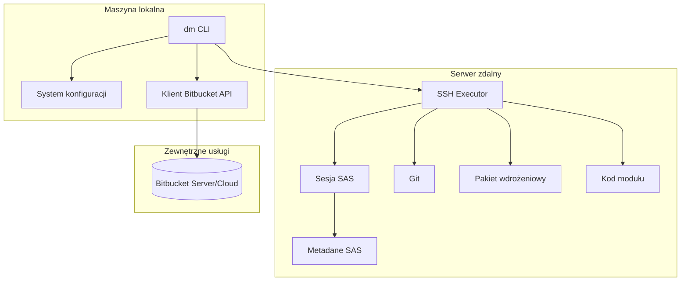
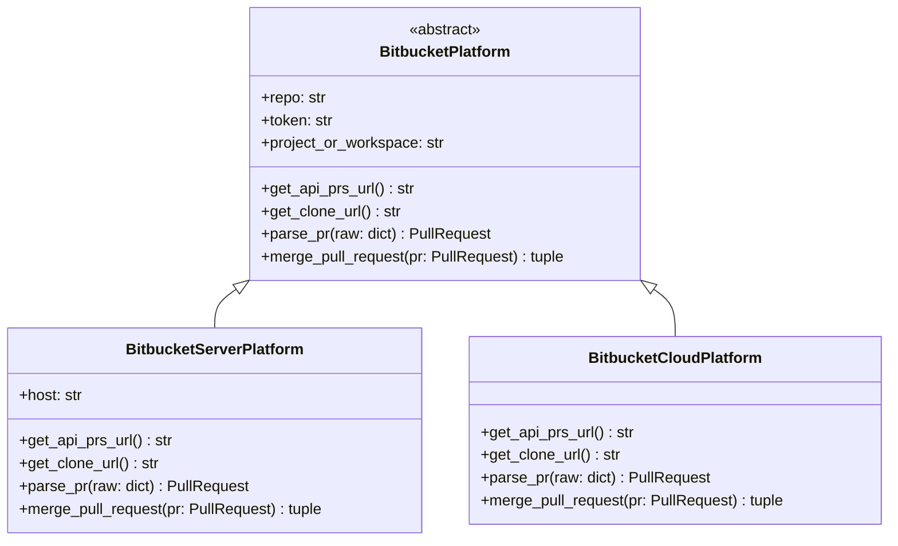
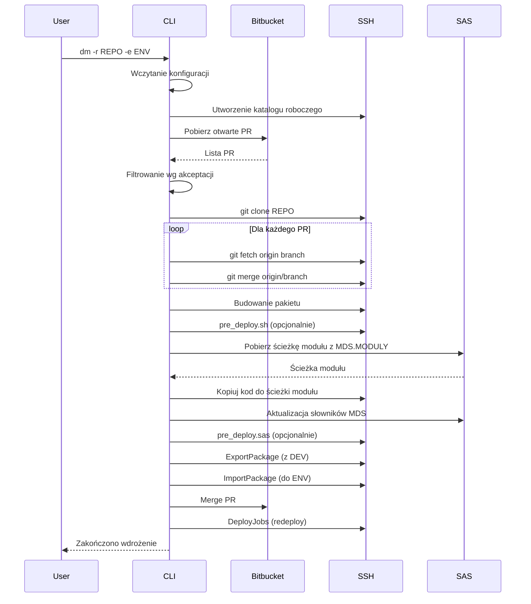

# Dokumentacja Techniczna Deployment Manager

**Wersja:** 0.3.0  
**Ostatnia aktualizacja:** 2026-01-29

---

## Spis treści

1. [Przegląd aplikacji](#przegląd-aplikacji)
2. [Architektura systemu](#architektura-systemu)
3. [Struktura projektu](#struktura-projektu)
4. [Moduły systemu](#moduły-systemu)
5. [System konfiguracji](#system-konfiguracji)
6. [Proces wdrożenia](#proces-wdrożenia)
7. [Integracja z Bitbucket](#integracja-z-bitbucket)
8. [Komunikacja SSH](#komunikacja-ssh)
9. [Integracja z SAS](#integracja-z-sas)
10. [Logowanie](#logowanie)
11. [Tryb mockowy](#tryb-mockowy)
12. [Stałe systemowe](#stałe-systemowe)
13. [Rozwiązywanie problemów](#rozwiązywanie-problemów)

---

## Przegląd aplikacji

Deployment Manager (`dm`) to narzędzie CLI automatyzujące proces wdrażania kodu i metadanych SAS w oparciu o Pull Requesty z Bitbucket. Aplikacja wykonuje wszystkie operacje na serwerze zdalnym przez połączenie SSH.

### Główne funkcjonalności

- Pobieranie i analiza Pull Requestów z Bitbucket (Server/Cloud)
- Automatyczne scalanie zakwalifikowanych PR na serwerze zdalnym
- Budowanie pakietu wdrożeniowego
- Wdrażanie kodu modułu na podstawie tabeli `MDS.MODULY`
- Aktualizacja słowników MDS
- Eksport i import metadanych SAS (pliki SPK)
- Redeploy jobów SAS
- Wykonywanie skryptów pre-deploy (bash i SAS)

### Wymagania systemowe

| Komponent | Wymaganie |
|-----------|-----------|
| Python | 3.9+ |
| SSH | Dostęp po kluczach dla `deploy_user` |
| Git | Zainstalowany na serwerze zdalnym |
| SAS | ExportPackage, ImportPackage, DeployJobs |
| Profile metadanych | Skonfigurowane dla `deploy_user` |

### Zależności Pythona

```
fabric      # Połączenia SSH i wykonywanie poleceń zdalnych
saspy       # Sesje SAS przez SSH
loguru      # System logowania
requests    # Komunikacja HTTP z API Bitbucket
```

---

## Architektura systemu



### Przepływ danych

1. **Inicjalizacja** - CLI parsuje argumenty i ładuje konfigurację
2. **Analiza PR** - Pobieranie listy otwartych PR z Bitbucket
3. **Kwalifikacja** - Filtrowanie PR wg liczby akceptacji
4. **Klonowanie** - Klonowanie repozytorium na serwerze zdalnym
5. **Scalanie lokalne** - Merge zakwalifikowanych gałęzi do HEAD
6. **Budowanie pakietu** - Tworzenie struktury katalogów i kopiowanie plików
7. **Wdrożenie kodu** - Aktualizacja katalogu modułu wg MDS.MODULY
8. **Operacje SAS** - Aktualizacja słowników, eksport/import metadanych
9. **Scalanie zdalne** - Merge PR w Bitbucket
10. **Finalizacja** - Redeploy jobów i raportowanie

---

## Struktura projektu

```
deployment_manager/
├── pyproject.toml              # Konfiguracja projektu i zależności
├── README.md                   # Dokumentacja użytkownika
├── GEMINI.md                   # Reguły dla AI asystentów
├── configs/                    # Pliki konfiguracyjne
│   ├── common.json             # Ustawienia wspólne
│   ├── dev.json                # Konfiguracja DEV
│   ├── uat.json                # Konfiguracja UAT
│   ├── prod.json               # Konfiguracja PROD
│   ├── local.json              # Lokalne nadpisania (git-ignored)
│   └── sascfg_personal.py      # Konfiguracja saspy
├── docs/                       # Dokumentacja techniczna
│   └── DOKUMENTACJA_TECHNICZNA.md
└── src/
    └── deployment_manager/
        ├── __init__.py
        ├── cli.py              # Punkt wejścia aplikacji
        ├── config.py           # System konfiguracji
        ├── bitbucket.py        # Klient API Bitbucket
        ├── models.py           # Modele danych (PullRequest)
        ├── constants.py        # Stałe systemowe
        ├── logger.py           # System logowania
        ├── mock.py             # Tryb mockowy dla testów
        ├── logic/              # Logika kroków wdrożenia
        │   ├── pr_analysis.py  # Analiza i scalanie PR
        │   ├── packaging.py    # Budowanie pakietu
        │   ├── code_update.py  # Aktualizacja kodu modułu
        │   ├── dictionaries.py # Aktualizacja słowników MDS
        │   ├── metadata.py     # Eksport/import metadanych
        │   ├── jobs.py         # Redeploy jobów SAS
        │   └── predeploy.py    # Skrypty pre-deploy
        └── remote/             # Komunikacja zdalna
            ├── ssh_executor.py # Executor SSH (Fabric)
            └── sas_session.py  # Zarządzanie sesjami SAS
```

---

## Moduły systemu

### cli.py - Punkt wejścia

Główny moduł aplikacji odpowiedzialny za:

- Parsowanie argumentów wiersza poleceń
- Inicjalizację konfiguracji i środowiska
- Orkiestrację kroków wdrożenia
- Obsługę trybu mockowego

**Argumenty CLI:**

| Argument | Opis | Wymagany |
|----------|------|----------|
| `-r`, `--repo` | Nazwa repozytorium Bitbucket | Tak |
| `-e`, `--env` | Środowisko docelowe (DEV/UAT/PROD) | Tak |
| `--mock` | Tryb mockowy (nie wykonuje rzeczywistych operacji) | Nie |

**Punkt wejścia:**

```python
def main() -> None:
    """Główna funkcja wykonująca wszystkie kroki"""
```

Zarejestrowany jako skrypt `dm` w `pyproject.toml`:

```toml
[project.scripts]
dm = "deployment_manager.cli:main"
```

### config.py - System konfiguracji

Klasa `Config` zarządza wczytywaniem i walidacją konfiguracji z plików JSON.

**Kolejność wczytywania:**

1. `common.json` - ustawienia bazowe
2. `<środowisko>.json` - ustawienia środowiskowe
3. `local.json` - lokalne nadpisania (opcjonalny)

**Wymagane klucze bazowe:**

```python
BASE_REQUIRED_KEYS = [
    "remote_git_path",
    "path_to_exportpackage",
    "path_to_importpackage",
    "path_to_deployjobs",
    "meta_repo",
    "appserver",
    "display",
    "batch_server",
    "is_bitbucket_server",
    "bitbucket_project_or_workspace",
    "bitbucket_host",
    "dm_runtime_base_dir",
]
```

**Wymagane klucze środowiskowe:**

```python
ENV_REQUIRED_KEYS = [
    "deploy_user",
    "server_machine",
    "server_port",
    "deployed_jobs_dir",
    "meta_profile",
    "ssh_host",
    "approvals",
]
```

**Token Bitbucket:**

Pobierany z zmiennej środowiskowej `BITBUCKET_API_TOKEN` lub klucza `bitbucket_api_token` w konfiguracji.

### bitbucket.py - Klient API

Moduł obsługuje komunikację z Bitbucket Server i Cloud.

**Hierarchia klas:**



**Funkcje pomocnicze:**

- `create_platform(config, repo)` - Tworzy odpowiednią implementację platformy
- `get_pull_requests(platform, timeout)` - Pobiera listę otwartych PR

**API endpoints:**

| Platforma | URL wzorzec |
|-----------|-------------|
| Server | `https://{host}/rest/api/1.0/projects/{project}/repos/{repo}/pull-requests` |
| Cloud | `https://api.bitbucket.org/2.0/repositories/{workspace}/{repo}/pullrequests` |

### models.py - Modele danych

**Dataclass `PullRequest`:**

```python
@dataclass
class PullRequest:
    id: int                              # Identyfikator PR
    title: str                           # Tytuł PR
    source_branch: str                   # Nazwa gałęzi źródłowej
    approval_count: int                  # Liczba akceptacji
    version: int | None = None           # Wersja PR (tylko Server)
    raw_data: dict[str, Any] = field()   # Surowe dane z API
```

**Funkcje parserów:**

- `parse_server_pr(raw)` - Parsuje odpowiedź Bitbucket Server
- `parse_cloud_pr(raw)` - Parsuje odpowiedź Bitbucket Cloud

---

## System konfiguracji

### Struktura plików JSON

**common.json** - Ustawienia wspólne dla wszystkich środowisk:

```json
{
    "bitbucket_project_or_workspace": "cri",
    "bitbucket_host": "bitbucket",
    "is_bitbucket_server": true,
    "dm_runtime_base_dir": "/migracje/dm_runtime",
    "remote_git_path": "/opt/freeware/bin/git",
    "display": "vdesk10345:0.0",
    "path_to_exportpackage": "/sas/sas94/SASPlatformObjectFramework/9.4/ExportPackage",
    "path_to_importpackage": "/sas/sas94/SASPlatformObjectFramework/9.4/ImportPackage",
    "path_to_deployjobs": "/sas/sas94/SASDataIntegrationStudioServerJARs/4.8/DeployJobs",
    "batch_server": "ENGINEAdmin - SAS DATA Step Batch Server",
    "meta_repo": "Foundation",
    "appserver": "ENGINEAdmin",
    "dev_meta_profile": "deploy_ndev1"
}
```

**dev.json / uat.json / prod.json** - Ustawienia specyficzne dla środowiska:

```json
{
    "meta_profile": "deploy_ndev1",
    "deployed_jobs_dir": "/sas/conf/Lev2/ENGINEAdmin/SASEnvironment/SASCode/Jobs",
    "server_machine": "misdev1",
    "server_port": 8595,
    "ssh_host": "misdev1",
    "approvals": 0,
    "deploy_user": "misadmin"
}
```

**local.json** - Lokalne nadpisania (ignorowany przez git):

```json
{
    "bitbucket_api_token": "wygenerowany_token"
}
```

### Opis kluczy konfiguracyjnych

| Klucz | Opis |
|-------|------|
| `bitbucket_project_or_workspace` | Projekt (Server) lub workspace (Cloud) |
| `bitbucket_host` | Hostname serwera Bitbucket |
| `is_bitbucket_server` | `true` dla Server, `false` dla Cloud |
| `dm_runtime_base_dir` | Katalog bazowy dla katalogów roboczych |
| `remote_git_path` | Ścieżka do pliku wykonywalnego git na serwerze |
| `display` | Zmienna DISPLAY dla narzędzi SAS |
| `path_to_exportpackage` | Ścieżka do ExportPackage |
| `path_to_importpackage` | Ścieżka do ImportPackage |
| `path_to_deployjobs` | Ścieżka do DeployJobs |
| `batch_server` | Nazwa serwera batch SAS |
| `meta_repo` | Nazwa repozytorium metadanych SAS |
| `appserver` | Nazwa serwera aplikacji SAS |
| `meta_profile` | Profil metadanych dla środowiska |
| `dev_meta_profile` | Profil DEV używany do eksportu |
| `deployed_jobs_dir` | Katalog z wdrożonymi jobami |
| `server_machine` | Nazwa maszyny serwera SAS |
| `server_port` | Port serwera SAS |
| `ssh_host` | Host SSH do połączenia |
| `approvals` | Wymagana liczba akceptacji PR |
| `deploy_user` | Użytkownik SSH do wdrożeń |

### Konfiguracja saspy

Plik `configs/sascfg_personal.py` definiuje konfiguracje sesji SAS. Nazwy konfiguracji konstruowane są wg wzorca:

- Windows: `ssh_win_batch_{środowisko}`
- UNIX: `ssh_batch_{środowisko}`

Przykład: dla środowiska DEV na UNIX używana jest konfiguracja `ssh_batch_dev`.

---

## Proces wdrożenia

### Diagram sekwencji



### Kroki wdrożenia - szczegóły

#### 1. Analiza Pull Requestów (`logic/pr_analysis.py`)

**Funkcja `analyze_pull_requests`:**

- Pobiera otwarte PR z Bitbucket
- Filtruje wg minimalnej liczby akceptacji
- Zwraca listę zakwalifikowanych PR

**Wymagania akceptacji:**

| Środowisko | Wymagane akceptacje |
|------------|---------------------|
| DEV | 0 |
| UAT | ≥1 |
| PROD | ≥2 |

**Funkcja `merge_local`:**

- Klonuje repozytorium na serwer zdalny
- Zbiera zmienione pliki dla każdego PR
- Scala gałęzie do HEAD przez `git merge`

**Funkcja `merge_remote`:**

- Scala zakwalifikowane PR w Bitbucket po pomyślnym wdrożeniu

#### 2. Budowanie pakietu (`logic/packaging.py`)

**Struktura katalogu roboczego:**

```
dm_<timestamp>_<uuid>/
├── repo/                    # Sklonowane repozytorium
├── codes/                   # Kod do wdrożenia
│   ├── kody/               # Kod modułu (z repo)
│   └── dodatkowe_pliki/    # Pliki z dodatkowe_pliki/
├── spks/                    # Pakiety metadanych SPK
├── logs/                    # Logi operacji
├── meta.txt                 # Definicja metadanych (scalony)
├── pre_deploy.sas           # Skrypt SAS (scalony)
└── pre_deploy.sh            # Skrypt bash (scalony)
```

**Scalanie plików CRISPR:**

Pliki o nazwie `CRISPR-{id}_{nazwa}` z `dodatkowe_pliki/` są automatycznie scalane do pliku `{nazwa}` w katalogu roboczym. Przykład:

```
CRISPR-123_meta.txt + CRISPR-456_meta.txt → meta.txt
CRISPR-123_pre_deploy.sas + CRISPR-456_pre_deploy.sas → pre_deploy.sas
```

#### 3. Skrypty pre-deploy (`logic/predeploy.py`)

**`pre_deploy.sh`:**

- Wykonywany jeśli istnieje w katalogu roboczym
- Log zapisywany do `logs/pre_deploy_bash.log`

**`pre_deploy.sas`:**

- Wykonywany przez sesję SAS
- Automatycznie ustawiana zmienna makro `&srodowisko`
- Log zapisywany do `logs/pre_deploy_sas.log`

#### 4. Aktualizacja kodu modułu (`logic/code_update.py`)

**Funkcja `update_module_code`:**

1. Pobiera ścieżkę docelową z tabeli SAS `MDS.MODULY`:

   ```sas
   data _null_;
       set MDS.MODULY(where=(lowcase(MODUL) = '{repo}'));
       call symputx('sciezka', trim(SCIEZKA_DO_MODULU));
       stop;
   run;
   ```

2. Usuwa istniejący katalog `kody/` w ścieżce docelowej
3. Kopiuje nowy katalog `codes/kody/` do ścieżki docelowej

#### 5. Aktualizacja słowników MDS (`logic/dictionaries.py`)

**Warunki uruchomienia:**

- Środowisko inne niż DEV
- Istnieją pliki `CRISPR-*_mds.txt` w `dodatkowe_pliki/`

**Format pliku `*_mds.txt`:**

```
SLOWNIK_1
SLOWNIK_2
SLOWNIK_3
```

**Generowane wywołania makra:**

```sas
%usr_zaktualizuj_slownik(slownik=SLOWNIK_1, id_zadania=CRISPR-123, srodowisko_docelowe=UAT);
```

#### 6. Eksport metadanych (`logic/metadata.py`)

**Warunki uruchomienia:**

- Istnieje plik `meta.txt` w katalogu roboczym

**Format pliku `meta.txt`:**

```
/Shared Data/DI Studio/Jobs/JOB_1 (Job)
/Shared Data/DI Studio/Jobs/JOB_2 (Job)
/Shared Data/SAS Flows/FLOW_1 (DeployedFlow)
```

**Polecenie ExportPackage:**

```bash
ExportPackage -disableX11 \
    -profile {dev_meta_profile} \
    -package {spk_file} \
    -log {log_file} \
    -subprop {subprop_file} \
    -objects {lista obiektów}
```

#### 7. Import metadanych (`logic/metadata.py`)

**Warunki uruchomienia:**

- Istnieje plik `spks/metadata.spk`

**Polecenie ImportPackage:**

```bash
ImportPackage -disableX11 \
    -profile {meta_profile} \
    -target "/" \
    -package {spk_file} \
    -subprop {subprop_file} \
    --includeACL \
    -preservePaths \
    -log {log_file}
```

#### 8. Redeploy jobów (`logic/jobs.py`)

**Warunki uruchomienia:**

- Istnieją wpisy `(Job)` w `meta.txt`

**Polecenie DeployJobs:**

```bash
export DISPLAY={display};
DeployJobs -deploytype REDEPLOY \
    -profile {meta_profile} \
    -metarepository {meta_repo} \
    -appservername {appserver} \
    -servermachine {server_machine} \
    -serverport {server_port} \
    -batchserver {batch_server} \
    -sourcedir {deployed_jobs_dir} \
    -deploymentdir {deployed_jobs_dir} \
    -log {log_file} \
    -objects {lista jobów}
```

**Raportowanie DeployedFlow:**

- Wyświetla listę flowów oznaczonych jako `(DeployedFlow)` w `meta.txt`
- Przypomina o aktualizacji na serwerze LSF

---

## Integracja z Bitbucket

### Bitbucket Server vs Cloud

| Aspekt | Server | Cloud |
|--------|--------|-------|
| API Base URL | `https://{host}/rest/api/1.0/` | `https://api.bitbucket.org/2.0/` |
| Clone URL | `ssh://git@{host}:7999/{project}/{repo}.git` | `git@bitbucket.org:{workspace}/{repo}.git` |
| Autoryzacja | Bearer Token | Bearer Token |
| Pole akceptacji | `reviewers[].approved` | `participants[].approved` |
| Wersja PR | `version` (wymagana do merge) | Nie dotyczy |

### Obsługa merge

**Bitbucket Server:**

```http
POST /rest/api/1.0/projects/{project}/repos/{repo}/pull-requests/{id}/merge?version={version}
```

**Bitbucket Cloud:**

```http
POST /2.0/repositories/{workspace}/{repo}/pullrequests/{id}/merge
```

### Obsługa błędów HTTP

Moduł używa `requests` z retry przez `HTTPAdapter`:

- Retry dla statusów: 502, 503, 504
- Maksymalnie 3 próby z backoff

---

## Komunikacja SSH

### SSHExecutor (`remote/ssh_executor.py`)

Klasa opakowująca bibliotekę Fabric do wykonywania operacji zdalnych.

**Metody:**

| Metoda | Opis |
|--------|------|
| `run_command(command, cwd, suppress_error_print, timeout)` | Wykonuje polecenie zdalne |
| `exists(remote_path)` | Sprawdza czy ścieżka istnieje |
| `mkdir(remote_path)` | Tworzy katalog (rekurencyjnie) |
| `rmdir(remote_path)` | Usuwa plik/katalog rekurencyjnie |
| `write_file(remote_path, content, encoding)` | Zapisuje plik przez SFTP |
| `read_file(remote_path, encoding)` | Odczytuje plik przez SFTP |

**RemotePath:**

Alias typu dla `PurePosixPath` używany do reprezentacji ścieżek na serwerze zdalnym:

```python
RemotePath = PurePosixPath
```

**Funkcja pomocnicza:**

```python
def quote_shell(value: RemotePath | str) -> str:
    """Zwraca bezpiecznie zacytowaną (shell) reprezentację ścieżki."""
    return shlex.quote(str(value))
```

### Obsługa błędów

Wszystkie niepowodzenia poleceń zdalnych zgłaszają `UnexpectedExit` z invoke:

```python
from invoke.exceptions import UnexpectedExit

try:
    ssh_executor.run_command("command")
except UnexpectedExit as exc:
    print(f"Return code: {exc.result.return_code}")
    print(f"STDOUT: {exc.result.stdout}")
    print(f"STDERR: {exc.result.stderr}")
```

---

## Integracja z SAS

### Sesje SAS (`remote/sas_session.py`)

**Zarządzanie sesjami:**

```python
@contextmanager
def open_sas_session(env: str) -> Iterator[saspy.SASsession]:
    """Tworzy i zwraca nową sesję SAS dla podanego środowiska."""
```

Używa context managera do automatycznego zamykania sesji.

**Wykonywanie kodu SAS:**

```python
def submit_sas_code(
    sas_session: saspy.SASsession,
    ssh_executor: SSHExecutor,
    sas_code: str,
    log_file: RemotePath | str,
) -> str:
    """Wysyła kod SAS do wykonania, zapisuje log i zwraca jego treść."""
```

**Analiza logów:**

Funkcja `_check_sas_log` wyszukuje linie rozpoczynające się od `ERROR` lub `WARNING` i raportuje je.

### Konfiguracja saspy

Plik `sascfg_personal.py` musi definiować konfiguracje dla każdego środowiska. Przykład:

```python
ssh_batch_dev = {
    'saspath' : '/sas/sas94/SASFoundation/9.4/bin/sas_en',
    'ssh' : '/usr/bin/ssh',
    'host' : 'misdev1',
    'port' : 8595,
    'encoding' : 'latin1',
    'tunnel' : 8595,
    'options' : ["-fullstimer", "-noterminal"],
}
```

---

## Logowanie

### System logowania (`logger.py`)

Oparty o bibliotekę `loguru` z niestandardowym formatowaniem.

**Funkcje logowania:**

| Funkcja | Poziom | Zastosowanie |
|---------|--------|--------------|
| `info(msg)` | INFO | Informacje ogólne |
| `warn(msg)` | WARNING | Ostrzeżenia |
| `error(msg)` | ERROR | Błędy |
| `step(msg)` | INFO | Wyróżniony krok procesu |
| `ok(msg)` | INFO | Potwierdzenie sukcesu |
| `list_block(header, items)` | INFO | Lista elementów |

**Format wyjścia:**

```
INFO     2026-01-29 22:14:28 Wiadomość
WARNING  2026-01-29 22:14:28 Ostrzeżenie
ERROR    2026-01-29 22:14:28 Błąd
```

**Konfiguracja:**

```python
def setup_logging() -> None:
    """Konfiguruje logowanie do stdout z czytelnym formatem."""
```

Wywoływana automatycznie w `main()`.

### Pliki logów na serwerze

| Plik | Opis |
|------|------|
| `logs/pre_deploy_bash.log` | Log skryptu pre_deploy.sh |
| `logs/pre_deploy_sas.log` | Log skryptu pre_deploy.sas |
| `logs/metadata_export.log` | Log ExportPackage |
| `logs/metadata_import.log` | Log ImportPackage |
| `logs/redeploy_jobs.log` | Log DeployJobs |
| `logs/update_dictionaries.log` | Log aktualizacji słowników |
| `logs/get_module_path.log` | Log odczytu ścieżki modułu |

---

## Tryb mockowy

Moduł `mock.py` dostarcza `MockSSHExecutor` do testowania bez rzeczywistych połączeń SSH.

**Uruchomienie:**

```bash
dm -r REPO -e DEV --mock
```

**Funkcjonalności mock:**

- Symulacja struktur katalogów
- Mockowe dane PR z Bitbucket
- Brak rzeczywistych połączeń SSH/SAS

---

## Stałe systemowe

Plik `constants.py` definiuje stałe używane w całym projekcie:

```python
CODES_DIR_NAME = "codes"                    # Katalog z kodem w pakiecie
REPO_CODES_DIR_NAME = "kody"                # Katalog z kodem w repozytorium
EXTRA_FILES_DIR_NAME = "dodatkowe_pliki"    # Katalog z plikami dodatkowymi
META_FILE_NAME = "meta.txt"                 # Plik definicji metadanych
PRE_DEPLOY_SCRIPT_NAME = "pre_deploy.sas"   # Skrypt SAS pre-deploy
PRE_DEPLOY_BASH_SCRIPT_NAME = "pre_deploy.sh" # Skrypt bash pre-deploy
SPKS_DIR_NAME = "spks"                      # Katalog na pakiety SPK
LOGS_DIR_NAME = "logs"                      # Katalog na logi
METADATA_SPK_NAME = "metadata.spk"          # Nazwa pakietu metadanych
METADATA_SUBPROP_NAME = "metadata.subprop"  # Plik właściwości pakietu
REMOTE_REPO_DIR_NAME = "repo"               # Katalog repozytorium w pakiecie
JOBS_TO_REDEPLOY_FILENAME = "jobs_to_redeploy.txt" # Lista jobów do redeployu
DEPLOY_DIR_PREFIX = "dm_"                   # Prefiks katalogów roboczych
```

---

## Rozwiązywanie problemów

### Typowe problemy

#### Błąd połączenia SSH

**Objaw:**

```
Connection refused
```

**Rozwiązanie:**

1. Sprawdź konfigurację `.ssh/config`
2. Upewnij się, że klucze SSH są wymienione
3. Zweryfikuj `ssh_host` i `deploy_user` w konfiguracji

#### Brak wymaganych kluczy konfiguracyjnych

**Objaw:**

```
ValueError: Brak wymaganych kluczy w konfiguracji: klucz1, klucz2
```

**Rozwiązanie:**

1. Sprawdź pliki `common.json` i `{env}.json`
2. Dodaj brakujące klucze

#### Błąd tokena Bitbucket

**Objaw:**

```
401 Unauthorized
```

**Rozwiązanie:**

1. Wygeneruj nowy token w Bitbucket
2. Ustaw zmienną środowiskową: `export BITBUCKET_API_TOKEN="token"`
3. Lub dodaj do `configs/local.json`

#### Konflikt podczas merge

**Objaw:**

```
error: Scalanie nie powiodło się
```

**Rozwiązanie:**

1. Rozwiąż konflikt ręcznie w PR
2. Uruchom wdrożenie ponownie

#### Błąd SAS

**Objaw:**

```
ERROR: ...
```

**Rozwiązanie:**

1. Sprawdź log SAS w `logs/` na serwerze zdalnym
2. Zweryfikuj konfigurację `sascfg_personal.py`
3. Upewnij się, że profil metadanych jest poprawny

### Diagnostyka

**Sprawdzenie połączenia SSH:**

```bash
ssh deploy_user@ssh_host "echo test"
```

**Sprawdzenie git na serwerze:**

```bash
ssh deploy_user@ssh_host "/opt/freeware/bin/git --version"
```

**Sprawdzenie narzędzi SAS:**

```bash
ssh deploy_user@ssh_host "ls -la /sas/sas94/SASPlatformObjectFramework/9.4/"
```

---

## Historia zmian

| Wersja | Data | Zmiany |
|--------|------|--------|
| 0.3.0 | 2026-01-29 | Refaktoring modelu PullRequest, dokumentacja techniczna |
| 0.2.x | - | Wsparcie dla Bitbucket Cloud, tryb mockowy |
| 0.1.x | - | Pierwsza wersja z podstawową funkcjonalnością |
